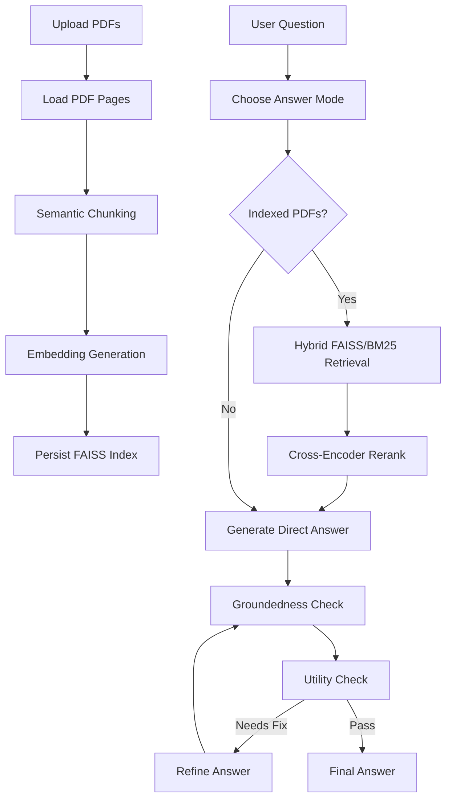

# Self-RAG PDF Q&A

Self-RAG PDF Q&A is a Streamlit application for asking questions over one or more PDF documents. It ingests uploaded PDFs, creates semantic chunks, indexes them in FAISS, retrieves evidence with hybrid search, reranks the best passages, and uses a LangGraph Self-RAG workflow to generate and verify grounded answers.

The project is designed for technical PDFs such as research papers, reports, specifications, documentation, and algorithm descriptions.

## What It Does

- Upload multiple PDFs through a Streamlit UI.
- Parse PDF pages with `pdfplumber`, with `pypdf` fallback.
- Split pages into semantic chunks using embedding similarity.
- Store chunks in a persistent FAISS vector index.
- Retrieve candidate passages with hybrid dense + lexical search.
- Rerank retrieved passages with a cross-encoder.
- Use text answers by default, switching to code only when explicitly requested.
- Retrieve from indexed documents automatically for document questions.
- Keep reranked context for answer generation instead of dropping chunks with an LLM relevance gate.
- Generate grounded answers with Groq.
- Check answer groundedness and usefulness.
- Refine weak answers through a Self-RAG feedback loop.
- Show citations, verification status, and the agent trace in the UI.

## Core Pipeline



## Retrieval Design

This project now uses two retrieval signals before reranking:

- Dense retrieval: FAISS similarity search over HuggingFace embeddings.
- Lexical retrieval: a lightweight BM25-style score over stored chunks.

The hybrid score helps the system catch both semantic matches and exact references such as method names, variable names, APIs, equations, section numbers, dataset names, and rare technical terms.

After hybrid retrieval, the cross-encoder reranker chooses the strongest passages for the Self-RAG generation and verification steps.

## Semantic Chunking

Semantic chunking groups nearby paragraphs or sentence blocks based on embedding similarity. This usually creates more meaningful context windows than simple character splitting.

The chunker still falls back to recursive character splitting when a section is too large, so oversized pages remain indexable.

Important chunking settings live in `.env`:

```env
SEMANTIC_CHUNKING=true
CHUNK_SIZE=1000
CHUNK_OVERLAP=200
SEMANTIC_MIN_CHUNK_SIZE=350
SEMANTIC_SIMILARITY_THRESHOLD=0.58
```

## How Many PDFs Can You Upload At Once?

The app supports multiple PDFs at once because Streamlit is configured with `accept_multiple_files=True`.

By default, the app allows up to 20 PDFs in one upload batch. You can change this with:

```env
MAX_UPLOAD_FILES=20
```

The practical limit also depends on:

- PDF size and number of pages.
- Available RAM.
- CPU speed.
- Time needed to embed chunks.
- Streamlit upload limits.
- Local disk space for `data/uploads/` and `data/faiss_index/`.

Recommended practical starting point:

- Small PDFs, under 20 pages each: upload 10-20 at once.
- Medium research papers, around 20-50 pages each: upload 3-8 at once.
- Large books, reports, or scanned PDFs: upload 1-2 at once.

For best reliability, index PDFs in batches. Uploading more PDFs later appends new chunks to the existing FAISS index.

## Project Structure

```text
self-rag-pdf-qa/
  app/
    agents/
      graph.py        # LangGraph workflow
      nodes.py        # Self-RAG node implementations
      state.py        # Agent state schema
    ingestion/
      chunker.py      # PDF loading and semantic chunking
    llm/
      groq_client.py  # Groq ChatGroq client
    prompts/
      self_rag.py     # Classifier, retrieval, generation, and verifier prompts
    retrieval/
      embeddings.py   # HuggingFace embedding model
      faiss_store.py  # FAISS store and hybrid retrieval
      reranker.py     # Cross-encoder reranker
    config.py         # Environment-driven settings
    main.py           # Streamlit application
    pipeline.py       # End-to-end app pipeline
  data/
    uploads/          # Uploaded PDF files
    faiss_index/      # Saved FAISS index
  .env.example        # Example configuration
  requirements.txt    # Python dependencies
  run.py              # App launcher
  streamlit_app.py    # Canonical Streamlit entrypoint
```

## Requirements

- Python 3.10 or newer.
- A Groq API key.
- Internet access for first-time model downloads.
- Around 2 GB of disk space for local model caches, depending on installed models.

## Setup

Create and activate a virtual environment:

```powershell
python -m venv .venv
.\.venv\Scripts\Activate.ps1
```

Install dependencies:

```powershell
pip install -r requirements.txt
```

Create your local environment file:

```powershell
copy .env.example .env
```

Edit `.env` and set your Groq key:

```env
GROQ_API_KEY=gsk_your_key_here
```

## How To Run

Run with the helper script:

```powershell
python run.py
```

Or run Streamlit directly:

```powershell
streamlit run streamlit_app.py
```

If you are using the existing virtual environment in this repo, you can also run:

```powershell
.\.venv\Scripts\python.exe run.py
```

This command also works now:

```powershell
streamlit run app/main.py
```

After the command starts, Streamlit will show a local URL such as:

```text
http://localhost:8501
```

Open that URL in your browser.

## How To Use

1. Start the app.
2. Upload one or more PDF files.
3. Click `Index PDFs`.
4. Wait for parsing, semantic chunking, embedding, and indexing to finish.
5. Ask a code or research question.
6. Click `Run Self-RAG`.
7. Review the answer, citations, groundedness status, utility status, and trace.

Example research questions:

```text
What is the main contribution of this paper?
Compare the proposed method with the baselines.
What limitations do the authors mention?
Explain the evaluation setup and key results.
```

Example code questions:

```text
Implement the algorithm described in section 3.
Convert the method into Python pseudocode.
What data preprocessing steps are required?
Write a minimal training loop based on the paper.
```

## Configuration

The main settings are controlled through `.env`.

```env
GROQ_API_KEY=
GROQ_MODEL=llama-3.3-70b-versatile

EMBEDDING_MODEL=sentence-transformers/all-MiniLM-L6-v2
RERANKER_MODEL=cross-encoder/ms-marco-MiniLM-L-6-v2

SEMANTIC_CHUNKING=true
CHUNK_SIZE=1000
CHUNK_OVERLAP=200
SEMANTIC_MIN_CHUNK_SIZE=350
SEMANTIC_SIMILARITY_THRESHOLD=0.58

HYBRID_SEARCH=true
HYBRID_DENSE_WEIGHT=0.65
LEXICAL_CANDIDATE_POOL=50
TOP_K_RETRIEVE=30
TOP_K_RERANK=10
MAX_UPLOAD_FILES=20

MAX_SELF_RAG_ITERATIONS=2
```

Useful tuning notes:

- Increase `TOP_K_RETRIEVE` if answers miss relevant passages.
- Increase `TOP_K_RERANK` if the model needs more context.
- Raise `HYBRID_DENSE_WEIGHT` to favor semantic matches.
- Lower `HYBRID_DENSE_WEIGHT` to favor exact terms and code symbols.
- Lower `SEMANTIC_SIMILARITY_THRESHOLD` to create larger semantic chunks.
- Raise `SEMANTIC_SIMILARITY_THRESHOLD` to create smaller, more focused chunks.
- Lower `MAX_UPLOAD_FILES` if you want smaller, safer indexing batches.

## Data Persistence

Uploaded PDFs are saved under:

```text
data/uploads/
```

The FAISS index is saved under:

```text
data/faiss_index/
```

When you upload and index more PDFs, the app appends new chunks to the existing index.

If you want a completely fresh index, stop the app and delete the contents of:

```text
data/faiss_index/
```

You may also clear:

```text
data/uploads/
```

## Troubleshooting

If the app says the Groq key is missing, check `.env`:

```env
GROQ_API_KEY=gsk_your_key_here
```

If the first run is slow, the embedding and reranker models are probably downloading.

If answers are too vague, try increasing:

```env
TOP_K_RETRIEVE=40
TOP_K_RERANK=12
```

If answers miss exact technical terms, try lowering the dense weight:

```env
HYBRID_DENSE_WEIGHT=0.50
```

If indexing is slow, upload fewer PDFs per batch or reduce PDF size.

If a PDF is scanned as images, text extraction may be weak. This project does not currently include OCR.

## Current Limitations

- No OCR for scanned/image-only PDFs.
- No duplicate document detection.
- No user authentication.
- Upload count is capped per batch, but there is no total corpus quota or duplicate-document detection.
- Lexical search is computed over the local in-memory docstore, so very large indexes may need a dedicated search backend later.

## Tech Stack

- Streamlit
- LangChain
- LangGraph
- FAISS
- HuggingFace sentence-transformer embeddings
- SentenceTransformers cross-encoder reranking
- Groq LLM API
- Python dotenv configuration
